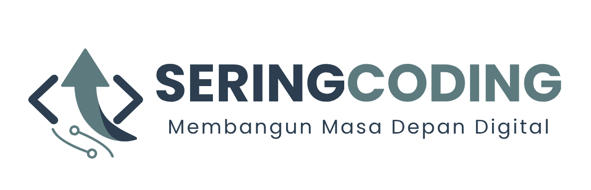

# 🚀 Smart CBT System - Update Log v1.2

Sering coding membuat Sistem Computer Based Test (CBT) dengan fitur pengacakan soal, jeda tahap ujian (Umum & Kejuruan), serta sistem koreksi otomatis yang dinamis.

Berikut adalah beberapa perbaikan yang dilakukan :

## Ringkas Peningkatan (Update Log v1.1)

> **Terakhir Diperbarui:** 18 Mei 2026  
> **Status:** `Unstable`  
> **Versi:** `1.1.0 (Keamanan & Efisiensi Resources)`

---

- Abstraksi `hitung_skor` : Menghilangkan ratusan baris kode duplikat. Sekarang perhitungan nilai dipusatkan pada satu fungsi privat internal.
- Keamanan Query Relasional: Penambahan penutup fungsi `where(function($query) ...)` menjamin data antar-siswa tidak bocor saat pencarian berbasis NISN atau Nomor Registrasi.
- Efisiensi Memori (Database RAM): Penghapusan `with('soal')`sebelum memanggil `count()` meringankan kerja server MySQL Anda secara drastis saat menangani traffic tinggi.
- Pembersihan Logika Kadaluwarsa: Menghilangkan kode periksa ulang sisa waktu fungsi `simpan_jawaban`.

---

## Ringkas Peningkatan (Update Log v1.2)

> **Terakhir Diperbarui:** 28 Mei 2026  
> **Status:** `Stable`  
> **Versi:** `1.2.0 (Koreksi & Navigasi Patch)`

---

Update ini berfokus pada **Integritas Data**, **Akurasi Penilaian**, dan **Pengalaman Pengguna (UX)** yang lebih intuitif.

### 🖥️ Frontend (Logic Navigasi & UI)

- **Smart Jump Navigation Fix**:
    - Memperbaiki hirarki tombol navigasi. Tombol **"Lompat ke Soal Belum Dijawab"** kini hanya muncul secara kontekstual saat user berada di nomor soal terakhir.
    - Mencegah tombol muncul secara prematur agar alur pengerjaan siswa tetap berurutan (linear).
- **Data Type Optimization**: Implementasi `Number()` casting pada variabel urutan soal untuk menjamin validitas perbandingan logika `(string vs number)`.
- **Submit Guard**: Sinkronisasi tombol **"Simpan Jawaban"** yang hanya aktif secara dinamis jika fungsi pengerjaan mendeteksi tidak ada lagi soal yang kosong.

### ⚙️ Backend (Sistem Koreksi & Pelaporan)

- **Multi-Stage Grading**: Sistem kini mampu memisahkan penghitungan skor secara otomatis antara kategori **Umum** dan **Kejuruan** dalam satu sesi ujian.
- **Dynamic Calculation (Zero Hardcoded)**:
    - Pembagi nilai akhir kini merujuk langsung pada tabel `SoalAcak` per individu.
    - Mendukung skalabilitas jika di masa depan terdapat perubahan jumlah bank soal tanpa perlu mengubah kode program.
- **Robust Data Architecture**:
    - Implementasi `optional()` dan _null-safe operator_ pada relasi Eloquent untuk mencegah _runtime error_.
    - Optimasi paginasi pada data koleksi hasil manipulasi menggunakan `getCollection()` dan `setCollection()`.

### 👨‍💼 Fitur Dashboard Admin

- **Advanced Search**: Fitur pencarian siswa (Nama/No. Registrasi) yang _persistent_ menggunakan _Query Appending_ (pencarian tidak hilang saat pindah halaman).
- **Automated Status Label**: Indikator visual **PASSED** atau **FAILED** berdasarkan ambang batas skor (KKM) per kategori soal.
- **Rich Detail Analysis**: Tampilan modal detail jawaban yang membandingkan Pertanyaan, Jawaban Siswa, dan Kunci Jawaban secara _side-by-side_.

---

## 📋 Struktur Data Koreksi (Preview)

Sistem mengelola data jawaban dengan struktur sebagai berikut untuk memastikan akurasi nilai:

- **Umum**: Perhitungan benar/salah dari 30 soal (Dinamis).
- **Kejuruan**: Perhitungan benar/salah dari 20 soal (Dinamis).
- **Nilai Akhir**: Rata-rata terbobot dari total poin pengerjaan.

# 🛠️ Stack Teknologi

| Komponen      | Teknologi                  |
| :------------ | :------------------------- |
| **Framework** | Laravel 10/11              |
| **Frontend**  | React / JavaScript & Blade |
| **Database**  | MySQL (Eloquent ORM)       |
| **Styling**   | Bootstrap 5 & Sass         |

## DEMO

Link demo belum tersedia.

## License [MIT](https://choosealicense.com/licenses/mit/)

Hak cipta (c) 2026 [M ADE MAULANA](https://)

Dengan ini diberikan izin, tanpa biaya, kepada siapa pun yang memperoleh salinannya dari perangkat lunak ini dan file dokumentasi terkait ("Perangkat Lunak"), untuk menangani dalam Perangkat Lunak tanpa batasan, termasuk tanpa batasan hak-hak untuk menggunakan, menyalin, memodifikasi, menggabungkan, penerbitkan, mendistribusikan, mensublisensikan, dan/atau menjual salinan Perangkat Lunak, dan untuk mengizinkan orang-orang yang memiliki Perangkat Lunak tersebut dilengkapi untuk melakukan hal tersebut, dengan tunduk pada kondisi-kondisi berikut:

Pemberitahuan hak cipta di atas dan pemberitahuan izin ini harus disertakan dalam semua salinan atau sebagian besar dari Perangkat Lunak.

PERANGKAT LUNAK INI DISEDIAKAN "SEBAGAIMANA ADANYA", TANPA GARANSI APA PUN, BAIK TERSURAT MAUPUN TERSIRAT TERSIRAT, TERMASUK NAMUN TIDAK TERBATAS PADA GARANSI KELAYAKAN DAGANG, KESESUAIAN UNTUK TUJUAN TERTENTU DAN TIDAK ADANYA PELANGGARAN HAK CIPTA. DALAM KEADAAN APA PUN, PENULIS ATAU PEMEGANG HAK CIPTA TIDAK BERTANGGUNG JAWAB ATAS KLAIM, KERUSAKAN, ATAU HAL LAINNYA TANGGUNG JAWAB, BAIK DALAM TINDAKAN KONTRAK, PERBUATAN MELANGGAR HUKUM ATAU LAINNYA, YANG TIMBUL DARI, BERKAITAN DENGAN ATAU BERHUBUNGAN DENGAN PERANGKAT LUNAK ATAU PENGGUNAAN ATAU TRANSAKSI LAINNYA DALAM PERANGKAT LUNAK.
